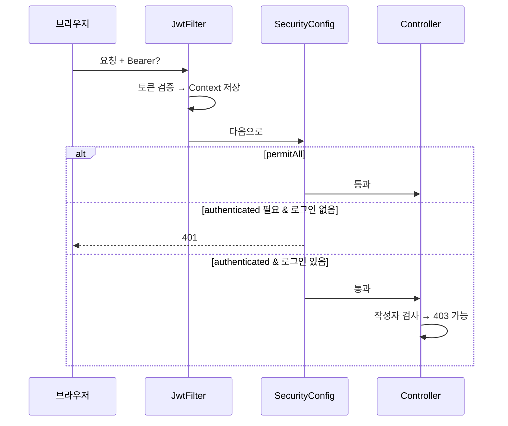

# 웹 보안 완전 정리 — 책 없이 따라하기

> **이 문서 하나로:** Spring Security + JWT 수업 이해 · 8가지 직접 실습 · 실무 보안 · 유출 대비까지  
> **대상 프로젝트:** `step17-board-backend` + `step17-board-front`  
> **실습 파일:** [lab-requests.http](lab-requests.http)

---

## 목차

1. [시작하기 — 환경 준비 (처음부터)](#1-시작하기--환경-준비-처음부터)
2. [핵심 개념 — 10분 요약](#2-핵심-개념--10분-요약)
3. [요청이 통과하는 전체 흐름](#3-요청이-통과하는-전체-흐름)
4. [파일 지도 — 어디를 보면 되나](#4-파일-지도--어디를-보면-되나)
5. [실습 8가지 — 사용법 포함 상세 가이드](#5-실습-8가지--사용법-포함-상세-가이드)
6. [Postman으로 하는 방법 (대안)](#6-postman으로-하는-방법-대안)
7. [프론트 실습 — 브라우저로 확인](#7-프론트-실습--브라우저로-확인)
8. [HTTP 코드 정리표 (401 vs 403)](#8-http-코드-정리표-401-vs-403)
9. [요즘 실무 보안은 어떻게 하나](#9-요즘-실무-보안은-어떻게-하나)
10. [자주 털리는 경우 & 대비법](#10-자주-털리는-경우--대비법)
11. [step17 — 잘 된 것 / 보완할 것](#11-step17--잘-된-것--보완할-것)
12. [유출 났을 때 대응 순서](#12-유출-났을 때-대응-순서)
13. [개발 습관 체크리스트](#13-개발-습관-체크리스트)
14. [자주 묻는 질문 & 오류 해결](#14-자주-묻는-질문--오류-해결)
15. [학습 로드맵 & 시험 암기표](#15-학습-로드맵--시험-암기표)

---

## 1. 시작하기 — 환경 준비 (처음부터)

### 1-1. 필요한 프로그램

| 프로그램 | 확인 명령 | 없으면 |
|----------|-----------|--------|
| Java 17+ | `java -version` | [adoptium.net](https://adoptium.net) |
| Node.js 18+ | `node -v` | [nodejs.org](https://nodejs.org) LTS |
| MySQL 8 | MySQL Workbench 또는 서비스 확인 | 설치 후 `new_board_db` 생성 |
| Cursor/VS Code | — | REST Client 확장 권장 |

### 1-2. MySQL 준비

**1) MySQL 서버 실행** (Windows 서비스 또는 Workbench)

**2) DB + 테이블 만들기** (처음 한 번)

```powershell
# board.sql 실행 (MySQL Workbench에서 파일 열기 → 실행)
# 경로: c:\work_spring\step17-board-backend\src\main\resources\board.sql
```

**3) DB 접속 정보** (`application.properties`)

```
url: jdbc:mysql://localhost:3306/new_board_db
username: root
password: (본인 MySQL 비밀번호)
```

비밀번호가 다르면 `step17-board-backend\src\main\resources\application.properties` 수정.

### 1-3. 백엔드 실행 (터미널 1)

```powershell
cd c:\work_spring\step17-board-backend
.\gradlew.bat bootRun
```

**성공 신호:** 콘솔에 `Started Step17BoardBackendApplication`  
**포트:** `http://localhost:8888`

**실패할 때:**

| 증상 | 해결 |
|------|------|
| `Communications link failure` | MySQL 안 켜짐 |
| `Access denied for user` | application.properties 비밀번호 틀림 |
| `Port 8888 was already in use` | 이미 실행 중 → 기존 터미널 종료 |

### 1-4. 프론트 실행 (터미널 2, 실습 G 이후)

```powershell
cd c:\work_spring\step17-board-front
npm install          # 처음 한 번만
npm start
```

**`.env` 파일** (프로젝트 루트, 없으면 생성):

```
REACT_APP_API_URL=http://localhost:8888
```

브라우저: `http://localhost:3000`

### 1-5. API 테스트 도구 준비

**방법 A — REST Client (추천, Cursor/VS Code)**

1. 확장 마켓에서 `REST Client` (Huachao Mao) 설치
2. [lab-requests.http](lab-requests.http) 파일 열기
3. `POST ...` 위에 뜨는 **`Send Request`** 클릭
4. 오른쪽 패널에 응답 JSON 표시

**방법 B — Postman** → [6절](#6-postman으로-하는-방법-대안) 참고

**방법 C — Swagger** (백엔드 켜진 상태)

브라우저에서 `http://localhost:8888/swagger-ui/index.html` (설정되어 있을 때)

---

## 2. 핵심 개념 — 10분 요약

### 2-1. 네 가지 용어

| 용어 | 영어 | 뜻 | 비유 |
|------|------|-----|------|
| 인증 | Authentication | **누구**인지 확인 | 출입증 검사 |
| 인가 | Authorization | **해도 되는지** 확인 | 본인 사물함만 열기 |
| BCrypt | — | 비밀번호 **단방향 암호화** | 금고에 넣으면 원래 비번 복구 불가 |
| JWT | JSON Web Token | 로그인 증명 **문자열** | 디지털 출입증 |

### 2-2. 세션 vs JWT

| | 세션 (옛날 방식) | JWT (수업 방식) |
|--|------------------|-----------------|
| 로그인 상태 저장 | 서버 메모리/DB | 클라이언트가 토큰 보관 |
| 클라이언트 전달 | 쿠키 `JSESSIONID` | 헤더 `Authorization: Bearer ...` |
| 서버 설정 | `SessionCreationPolicy` 기본 | **`STATELESS`** (세션 안 만듦) |
| 로그아웃 | 세션 삭제 → 즉시 무효 | Access Token은 만료까지 유효할 수 있음 |

### 2-3. JWT 구조 (외울 필요는 없지만 알면 좋음)

```
eyJhbGciOiJIUzI1NiJ9.eyJzdWIiOiJ1c2VyMSJ9.xxxxx
└─ header ─────────┘ └─ payload ──┘ └ signature ┘
```

- **Payload**는 Base64라 **누구나 읽을 수 있음** → 비밀번호 넣으면 안 됨
- **Signature**는 서버 비밀키로 검증 → 위조 방지

### 2-4. Access Token vs Refresh Token

| | Access Token | Refresh Token |
|--|--------------|---------------|
| 용도 | API 호출마다 첨부 | Access 만료 시 **재발급** |
| 수명 | 짧음 (수업: 30분) | 김 (수업: 7일) |
| 저장 | localStorage + 헤더 | localStorage + **DB** |
| 로그아웃 | 당장 무효화 어려움 | DB에서 삭제 → 재발급 차단 |

### 2-5. CORS가 뭔데?

- React `localhost:3000` → Spring `localhost:8888` 은 **포트가 달라 다른 출처**
- 브라우저가 "다른 사이트에서 우리 API 부르지 마"라고 막을 수 있음
- `SecurityConfig`의 `corsConfigrationSource()`가 **3000 포트 허용**

### 2-6. CSRF를 왜 끄나?

- CSRF = 다른 사이트가 내 쿠키로 요청 보내는 공격
- JWT는 **쿠키가 아니라 헤더**에 넣으므로 수업 프로젝트에서 CSRF 끔
- 쿠키로 JWT 쓰면 CSRF 대책 다시 필요

### 2-7. XSS와 DOMPurify

- XSS = 악성 `<script>`를 게시글에 넣어 다른 사람 브라우저에서 실행
- `dangerouslySetInnerHTML`은 HTML 그대로 삽입 → 위험
- **DOMPurify** = 위험 태그 제거 후 삽입

---

## 3. 요청이 통과하는 전체 흐름

### 3-1. 로그인할 때

```
[React] LoginPage → authApi.login()
    → POST /auth/login { username, password }
[Spring] AuthController → AuthService.login()
    → AuthenticationManager.authenticate()
    → UserDetailServiceImpl (DB에서 회원 조회)
    → PasswordEncoder (BCrypt 비교)
    → JwtTokenProvider (access + refresh 생성)
    → RefreshToken DB 저장
[React] localStorage에 토큰 저장 → /auth/me → user state
```

### 3-2. 글 목록 볼 때 (비로그인 OK)

```
GET /api/posts
→ JWT 필터 (토큰 없음 → 그냥 통과)
→ SecurityConfig: GET /api/posts/** = permitAll ✅
→ BoardController → 200
```

### 3-3. 글 쓸 때 (로그인 필수)

```
POST /api/posts + Authorization: Bearer 토큰
→ JWT 필터: 토큰 검증 → SecurityContext에 user 저장
→ SecurityConfig: authenticated ✅
→ BoardController: @AuthenticationPrincipal UserEntity → mid 설정
→ 200
```

### 3-4. 남의 글 삭제 (403)

```
DELETE /api/posts/5 + userB 토큰
→ 인증 OK (userB로 로그인됨)
→ BoardController: board.mid != userB.id
→ 403 Forbidden
```



---

## 4. 파일 지도 — 어디를 보면 되나

### 백엔드 `step17-board-backend`

```
src/main/java/com/spring/
├── config/
│   └── SecurityConfig.java      ← URL 규칙, CORS, BCrypt Bean
├── security/
│   ├── JwtTokenProvider.java    ← 토큰 생성·검증
│   ├── JwtAuthenticationFilter.java  ← 매 요청 Bearer 읽기
│   └── UserDetailServiceImpl.java    ← DB 회원 → UserDetails
├── service/
│   └── AuthService.java         ← signup, login, logout
├── controller/
│   ├── AuthController.java      ← /auth/*
│   └── BoardController.java     ← /api/posts/* + 403 검사
└── entity/
    └── UserEntity.java          ← UserDetails 구현
```

### 프론트 `step17-board-front`

```
src/
├── api/
│   ├── axiosInstance.js   ← Bearer 자동 첨부
│   └── authApi.js         ← signup, login, logout, me
├── context/
│   └── AuthContext.jsx    ← 전역 로그인 상태
└── pages/
    ├── LoginPage.jsx
    ├── PostDetailPage.jsx ← DOMPurify + 작성자 버튼
    └── PostWritePage.jsx
```

---

## 5. 실습 8가지 — 사용법 포함 상세 가이드

> **공통 준비:** MySQL 켜기 → `bootRun` 성공 확인 → [lab-requests.http](lab-requests.http) 열기

---

### 실습 A — 회원가입 & BCrypt 확인

**목표:** 비밀번호가 DB에 평문으로 안 들어가는지 확인

**단계:**

1. `lab-requests.http`에서 **「실습 A: 회원가입」** 블록 찾기
2. `Send Request` 클릭
3. 응답 확인:

```json
{
  "message": "회원가입이 완료되었습니다."
}
```

4. MySQL Workbench 또는 CLI:

```sql
USE new_board_db;
SELECT id, username, nickname, password
FROM board_member
ORDER BY id DESC
LIMIT 1;
```

**기대 결과:**

| username | password |
|----------|----------|
| sec-test-a | `$2a$10$xxxxxxxx...` (60자 가까운 해시) |

`1234`가 그대로 보이면 **보안 실패** — BCrypt 안 된 것.

**같은 아이디 다시 가입:** `400` 또는 `IllegalArgumentException` (중복)

---

### 실습 B — 로그인 & 토큰 & /auth/me

**목표:** JWT 받아서 내 정보 조회

**단계:**

1. **「실습 B: 로그인」** `Send Request`
2. 응답 예시:

```json
{
  "accessToken": "eyJhbGciOiJIUzI1NiJ9...",
  "refreshToken": "eyJhbGciOiJIUzI1NiJ9...",
  "tokenType": "Bearer"
}
```

3. `accessToken` **전체** 복사 (따옴표 제외)
4. `lab-requests.http` **맨 위** 수정:

```
@accessToken = eyJhbGciOiJIUzI1NiJ9...(붙여넣기)
```

5. **「실습 B: 내 정보」** `Send Request`

**기대 결과 (200):**

```json
{
  "id": 1,
  "username": "sec-test-a",
  "nickname": "보안테스트A",
  "role": "ROLE_USER"
}
```

**토큰 없이 /auth/me:** 401

---

### 실습 C — 토큰 없이 글쓰기 → 401

**목표:** SecurityConfig `authenticated` 동작 확인

**단계:**

1. **「실습 C」** 블록 — `Authorization` 헤더 **없음**
2. `Send Request`

**기대:** HTTP **401 Unauthorized**

**의미:** "로그인 안 했어요"

---

### 실습 D — 토큰 있으면 글쓰기 → 200

**단계:**

1. 실습 B에서 `@accessToken` 설정됐는지 확인
2. **「실습 D」** `Send Request`

**기대 (200):**

```json
{
  "board": { "bno": 1008, "title": "...", ... },
  "user": { "id": 1, "username": "sec-test-a", ... }
}
```

**`board.bno` 기억** — 실습 F에서 사용

---

### 실습 E — 비로그인 읽기 → 200 (permitAll)

**단계:**

1. **「실습 E」** 두 개 요청 (목록, 상세)
2. `@accessToken` 있어도 없어도 **200**

**의미:** `SecurityConfig`에서 `GET /api/posts/**` 는 누구나 OK

---

### 실습 F — 남의 글 삭제 → 403

**목표:** 인가(Authorization) — 인증(로그인)과 다름

**단계:**

1. **userA (`sec-test-a`)** 로 실습 D로 글 작성 → `bno` 확인 (예: 1008)
2. **「두 번째 계정」** 으로 `sec-test-b` 회원가입 + 로그인
3. userB의 `accessToken`을 복사해 `@accessToken`에 **교체**
4. `DELETE /api/posts/1008` (userA 글 번호) 실행

**기대:** HTTP **403 Forbidden**

5. userA 토큰으로 같은 DELETE → **204** (성공)

**프론트에서도:** userB로 로그인 후 userA 글 상세 → 수정/삭제 버튼 **안 보임**

---

### 실습 G — 새로고침 후 로그인 유지

**단계:**

1. 터미널 2에서 `npm start`
2. 브라우저 `http://localhost:3000` → 회원가입 또는 로그인
3. **F5** 새로고침
4. 여전히 로그인 상태 (닉네임/로그아웃 버튼 보임)

**확인 (개발자 도구 F12):**

- Application → Local Storage → `accessToken`, `refreshToken` 존재
- Network → `/auth/me` 요청 200

**코드 추적:** `AuthContext.jsx` 의 `useEffect` → `authApi.me()`

---

### 실습 H — 토큰 망가뜨리기 → 401

**단계:**

1. F12 → Application → Local Storage
2. `accessToken` 값 **마지막 글자 하나 삭제** 후 저장
3. 글쓰기 또는 새로고침

**기대:** API 401 → `AuthContext`가 `localStorage.clear()` 할 수 있음

---

### 실습 보너스 — XSS & DOMPurify

1. 로그인 후 글쓰기에서 본문에 입력:

```html
<p>안녕</p><script>alert('해킹')</script>
```

2. 상세 페이지에서 **alert 안 뜨면** DOMPurify 동작 중
3. DOMPurify 제거 시 alert 뜰 수 있음 (위험)

---

## 6. Postman으로 하는 방법 (대안)

REST Client 대신 Postman 쓸 때:

### 회원가입

- Method: `POST`
- URL: `http://localhost:8888/auth/signup`
- Body → raw → JSON:

```json
{
  "username": "postman-user",
  "password": "1234",
  "nickname": "포스트맨"
}
```

### 로그인

- `POST` `http://localhost:8888/auth/login`
- Body: `{ "username": "postman-user", "password": "1234" }`
- 응답에서 `accessToken` 복사

### 인증 필요 API

- Headers 탭:
  - Key: `Authorization`
  - Value: `Bearer eyJhbGci...` (**Bearer 뒤 공백 필수**)

### 글쓰기

- `POST` `http://localhost:8888/api/posts`
- Headers: Authorization + Content-Type application/json
- Body:

```json
{
  "title": "제목",
  "content": "<p>본문</p>"
}
```

---

## 7. 프론트 실습 — 브라우저로 확인

| 확인 항목 | 방법 |
|-----------|------|
| 로그인 | `/login` → 계정 입력 |
| 토큰 저장 | F12 → Local Storage |
| API 헤더 | F12 → Network → posts 요청 → Request Headers에 `Authorization` |
| 401 처리 | 토큰 삭제 후 글쓰기 시도 |
| 본인만 버튼 | 다른 계정 글 상세 → 수정/삭제 없음 |
| CORS 에러 | Console에 `CORS` → SecurityConfig origins 확인 |

---

## 8. HTTP 코드 정리표 (401 vs 403)

| 코드 | 이름 | 뜻 | 예시 |
|------|------|-----|------|
| **401** | Unauthorized | **로그인 안 함** 또는 토큰 무효 | 토큰 없이 POST |
| **403** | Forbidden | 로그인은 했는데 **권한 없음** | 남의 글 삭제 |
| **404** | Not Found | 리소스 없음 | 없는 bno |
| **204** | No Content | 성공, 본문 없음 | DELETE/PATCH 성공 |

**외우기:** 401 = 누구세요? / 403 = 당신은 안 돼요

---

## 9. 요즘 실무 보안은 어떻게 하나

웹 보안은 **한 가지로 끝나지 않고** 겹겹이 막습니다.

```
[사용자] ──HTTPS──▶ [방화벽/WAF] ──▶ [앱: 인증·인가·검증] ──▶ [DB: 최소권한·암호화]
```

### 9-1. 영역별 정리

| 영역 | 하는 일 | 수업에서 본 것 |
|------|---------|----------------|
| **전송** | 도청 방지 | HTTPS (실서비스 필수) |
| **인증** | 신원 확인 | JWT, BCrypt, OAuth |
| **인가** | 권한 확인 | 403, ROLE, 작성자 검사 |
| **입력** | 악성 데이터 차단 | DOMPurify, `#{}` MyBatis |
| **비밀관리** | 키·비번 유출 방지 | .env, gitignore |
| **인프라** | 서버 자체 보호 | 방화벽, 패치, 백업 |

### 9-2. 실무에서 JWT 저장 방식

| 방식 | 장점 | 단점 |
|------|------|------|
| localStorage (수업) | 구현 쉬움 | XSS에 토큰 노출 |
| httpOnly 쿠키 | JS로 못 읽음 → XSS 완화 | CSRF 대책 필요 |
| 메모리만 | 가장 안전에 가까움 | 새로고침 시 로그아웃 |

수업은 **localStorage** — 시험·학습에 적합. 실무는 팀 정책에 따라 쿠키 조합도 많음.

### 9-3. OAuth (Google 로그인)

```
사용자 → Google 로그인 → 우리 서버가 Google 정보 받음
→ DB 회원 연동 → 우리 JWT 발급 → 이후는 일반 JWT와 동일
```

quest/16 problem03 — 시험 범위 아니면 나중에.

---

## 10. 자주 털리는 경우 & 대비법

### ① 비밀번호·API 키 GitHub 유출

**털리는 방법:** `.env`, `application.properties`를 git에 push  
**피해:** DB 접속, API 요금 폭탄, JWT 위조  
**대비:**

- `.gitignore`에 `.env`, `config.py` 확인
- GitHub에 올렸으면 **즉시 키·비번 변경**
- `git secret` / 환경 변수 / AWS Secrets Manager (실무)

### ② SQL Injection

**털리는 방법:** 검색어에 `' OR '1'='1`  
**대비:** MyBatis **`#{}`** 사용 (수업 기본). `${}`는 SQL에 직접 붙여서 위험

### ③ XSS (Cross-Site Scripting)

**털리는 방법:** 게시글에 `<script>` → 다른 사용자 세션/토큰 탈취  
**대비:** DOMPurify, CSP 헤더, `dangerouslySetInnerHTML` 최소화

### ④ 인가 누락 (IDOR)

**털리는 방법:** URL의 `bno`만 바꿔 남의 글 삭제  
**대비:** **서버에서** `board.mid == loginUser.id` 검사 (수업 ✅)

### ⑤ JWT 설정 실수

| 실수 | 대비 |
|------|------|
| `jwt.secret` 짧거나 공개 | 256bit 이상 랜덤, 환경 변수 |
| Access Token 수명 너무 김 | 15~30분 |
| Refresh 없이 Access만 | 재발급·로그아웃 정책 약함 |
| Payload에 비밀번호 | 절대 금지 |

### ⑥ CORS 과다 허용

**실수:** `allowedOrigins("*")` + credentials  
**대비:** 운영 도메인만 명시 (수업: `localhost:3000`만)

### ⑦ 서버·DB 인터넷 노출

**실수:** MySQL `3306`을 0.0.0.0에 오픈 + 약한 root 비번  
**대비:** DB는 앱 서버 내부망만, 강한 비번, 정기 패치

### ⑧ 의존성 취약점

**실수:** `npm install` 후 방치  
**대비:** `npm audit`, Spring Boot 버전 업데이트

### ⑨ 피싱·운영 실수

코드와 무관하게 키가 슬랙·이메일에 붙거나 PC 악성코드  
**대비:** 2FA, 최소 권한, 키 로테이션

---

## 11. step17 — 잘 된 것 / 보완할 것

### ✅ 수업 프로젝트에서 잘 하고 있는 것

- [x] BCrypt 비밀번호 해시
- [x] JWT STATELESS
- [x] permitAll / authenticated URL 구분
- [x] 삭제·수정 시 작성자 검사 (403)
- [x] CORS localhost:3000 제한
- [x] Refresh Token DB + 로그아웃 시 삭제
- [x] DOMPurify (상세 HTML)
- [x] axios 인터셉터로 Bearer 자동 첨부

### 📌 실서비스라면 추가

| 항목 | 이유 |
|------|------|
| HTTPS | 토큰 도청 방지 |
| httpOnly 쿠키 옵션 | XSS 시 토큰 탈취 완화 |
| Rate limiting | 로그인 무차별 대입 방지 |
| `@Valid` 입력 검증 | 잘못된 요청 차단 |
| secret 환경 변수화 | properties 유출 대비 |
| 보안 헤더 (CSP, HSTS) | XSS·중간자 공격 완화 |
| 로그에 토큰/비번 안 찍기 | 로그 유출 시 피해 |

**시험·학습:** 위 ✅ 항목 이해 + 401/403 구분이면 충분.

---

## 12. 유출 났을 때 대응 순서

1. **즉시 폐기·재발급** — DB 비번, JWT secret, API Service Key, OAuth client secret
2. **범위 파악** — 언제부터, 어떤 데이터 (개인정보? 결제?)
3. **패치·배포** — 취약 코드 수정
4. **로그 보존** — 추적·신고용
5. **사용자 안내** — 비밀번호 변경 요청 (해당 시)
6. **재발 방지** — git hook, secret scan, 코드 리뷰

> 키는 **유출될 것을 전제**하고 주기적으로 갈아끼우는 팀이 많습니다.

---

## 13. 개발 습관 체크리스트

### 매일·매 커밋

- [ ] `.env` / DB 비번 / `jwt.secret` git에 없음
- [ ] 공공 API 키 코드에 하드코딩 없음
- [ ] 수정·삭제 API에 서버 측 권한 검사
- [ ] 사용자 HTML은 sanitize

### 배포 전

- [ ] HTTPS
- [ ] CORS 운영 도메인만
- [ ] DB 외부 포트 차단
- [ ] `npm audit` / Gradle 취약점 확인

### 실습할 때

- [ ] Postman으로 401·403 직접 확인
- [ ] 두 계정으로 남의 글 삭제 시도
- [ ] XSS 스크립트 넣어 DOMPurify 확인

---

## 14. 자주 묻는 질문 & 오류 해결

### Q. 로그아웃했는데 API가 되요

Access Token은 **만료 전까지** 유효. 로그아웃은 Refresh 삭제 → **재발급만** 막음.

### Q. sample_data 계정 로그인 안 돼요

시드는 평문 비번일 수 있음. `/auth/signup`으로 새 계정.

### Q. 401인데 토큰 넣었어요

1. `Bearer ` + 공백 + 토큰  
2. 토큰 만료 → 다시 login  
3. `@accessToken` 따옴표 안에 잘못 들어감  
4. 백엔드 8888 맞는지

### Q. CORS error

`SecurityConfig` → `setAllowedOrigins("http://localhost:3000")`  
프론트는 반드시 3000 포트.

### Q. 403 vs 401 헷갈려요

- 글쓰기 **안 로그인** → 401  
- **로그인했는데** 남 글 삭제 → 403

### Q. Connection refused localhost:8888

`bootRun` 안 됨 또는 아직 시작 중. `Started ...` 로그 확인.

### Q. MySQL Access denied

`application.properties`의 username/password 확인.

---

## 15. 학습 로드맵 & 시험 암기표

### 15-1. 추천 순서

| 주차 | 내용 |
|------|------|
| 1일 | 이 문서 1~5절 + 실습 A~E |
| 2일 | 실습 F~H + 프론트 + 9~11절 읽기 |
| 3일 | [quest/16 problem01](../16/problem01-jwt-backend/) |
| 4일 | quest/16 problem02 (React) |
| 5일 | problem04~05 (게시판 403) |

### 15-2. 시험·면접 30초 암기

```
인증 = 누구 / 인가 = 권한
JWT = Bearer 헤더 / BCrypt = 비번 해시
401 = 미로그인 / 403 = 권한없음
permitAll = SecurityConfig / 작성자검사 = Controller
STATELESS = 세션 없음
로그아웃 = Refresh DB 삭제
```

### 15-3. 손으로 그려볼 그림

1. 로그인 시퀀스 (Client → AuthController → JWT 발급)  
2. POST /api/posts 요청이 필터·SecurityConfig 거치는 순서  
3. DELETE 시 mid 비교 → 403

### 15-4. 연결 자료

| 문서 | 경로 |
|------|------|
| quest/16 문제 | [../16/README.md](../16/README.md) |
| React 실행법 | [../React-환경-및-진도-가이드.md](../React-환경-및-진도-가이드.md) |
| API 실습 HTTP | [lab-requests.http](lab-requests.http) |
| 짧은 인덱스 | [README.md](README.md) |

---

*마지막 업데이트: 2026-06-29 — step17 + DOMPurify 기준*
